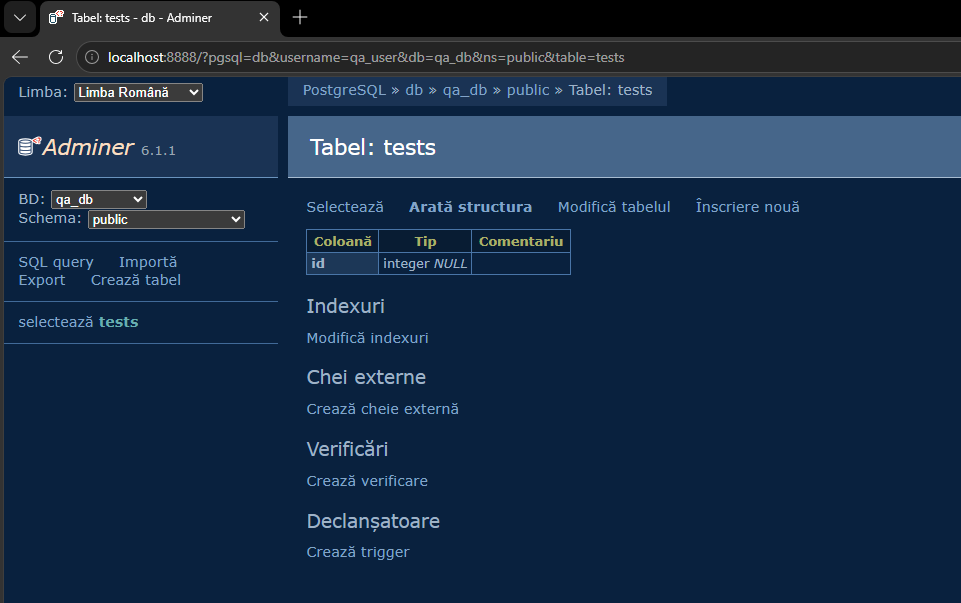

# Rezolvare — Mediu de Testare Multi-Serviciu cu Docker Compose

## Dovada funcționării
Tabelul `tests` creat cu succes în baza de date `qa_db` (prin Adminer):

## De ce este important flag-ul `-v` la `docker compose down`
`docker compose down -v` șterge, pe lângă containere și rețea, și **volumele**
(aici `db-data`), adică toate datele bazei. Pentru QA este esențial pentru că
fiecare rulare de teste pornește dintr-un mediu **curat și identic**, fără date
rămase de la testele anterioare care ar „polua" rezultatele. Astfel testele
devin reproductibile și deterministe.